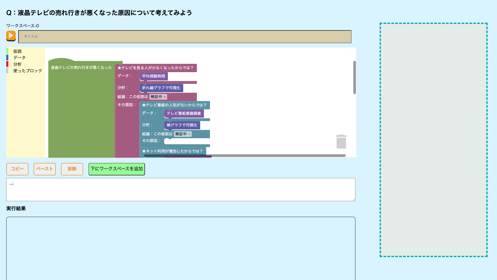

# 統計分析を題材とした批判的思考スキル育成支援システム：Statistics-block-building(SBB)

## What is this system?

Google製のビジュアルプログラミング環境Blocklyを発展的に拡張し，批判的思考をブロック表現で構成できるようにしたシステム．

## How to install this system?

## How to use this system?

## Auther

山口（yamaguchi@ksm.kis.osakafu-u.ac.jp）
油谷知岐（aburatanitomoki@gmail.com）